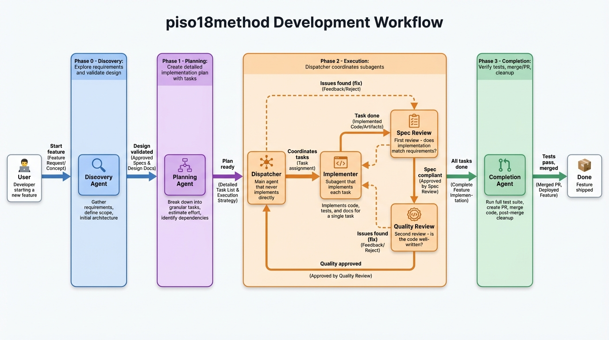

# piso18method

A Claude Code plugin that enforces a structured development methodology with four mandatory phases: **Discovery → Planning → Execution → Completion**.

## How It Works



The methodology enforces a sequential flow where each phase must be completed before moving to the next. The **Execution phase** uses a Dispatcher Pattern with two-stage code review to ensure quality.

---

## Installation

```bash
# 1. Add the marketplace
/plugin marketplace add diaztunjano/piso18method-marketplace

# 2. Install the plugin
/plugin install piso18method@piso18method-marketplace
```

---

## Quick Start

```bash
# Start a new feature
/piso18method:start add user authentication

# Check current phase and progress
/piso18method:status
```

---

## The Four Phases

### Phase 0: Discovery

> Turn vague ideas into validated designs through collaborative dialogue.

- Explore the codebase for context
- Ask clarifying questions (one at a time)
- Propose 2-3 approaches with trade-offs
- Document the validated design

### Phase 1: Planning

> Create detailed implementation plans with bite-sized tasks.

- Define exact file paths
- Include complete code snippets
- Add TDD steps for each task
- Keep tasks independent when possible

### Phase 2: Execution

> Implement using the Dispatcher Pattern with two-stage review.

The main agent (Dispatcher) **never implements directly**. Instead:

1. Dispatches an **Implementer** subagent for each task
2. Runs **Spec Review** - Does it match requirements?
3. Runs **Quality Review** - Is the code well-written?
4. Coordinates fixes if issues are found
5. Marks task complete only after both reviews pass

### Phase 3: Completion

> Verify, merge/PR, and cleanup.

- Run full test suite
- Present merge options (local merge, PR, keep branch, discard)
- Generate completion report

---

## Available Skills

### Core Phase Skills

| Skill | Phase | Purpose |
|-------|-------|---------|
| `piso18method:discovery` | 0 | Explore requirements and validate design |
| `piso18method:planning` | 1 | Create detailed implementation plan |
| `piso18method:execution` | 2 | Implement tasks with two-stage review |
| `piso18method:completion` | 3 | Verify and finalize the work |

### Supporting Skills

| Skill | Purpose |
|-------|---------|
| `piso18method:tdd` | Test-Driven Development - test first, then implement |
| `piso18method:verification` | Evidence before claims - run commands, then report |
| `piso18method:code-review` | Request and receive code reviews |
| `piso18method:debugging` | Systematic bug investigation |

---

## Key Principles

| Principle | Description |
|-----------|-------------|
| **No skipping phases** | Follow Discovery → Planning → Execution → Completion |
| **TDD always** | Write the test first, watch it fail, then implement |
| **Two-stage review** | Spec compliance first, then code quality |
| **Dispatcher Pattern** | Never pollute context - delegate to fresh subagents |
| **Evidence before claims** | Run verification commands before claiming success |

---

## Links

- [Plugin Repository](https://github.com/diaztunjano/piso18method)
- [Marketplace Repository](https://github.com/diaztunjano/piso18method-marketplace)

---

## License

MIT License - see [LICENSE](LICENSE)

## Author

David Diaz - david@piso18.io
